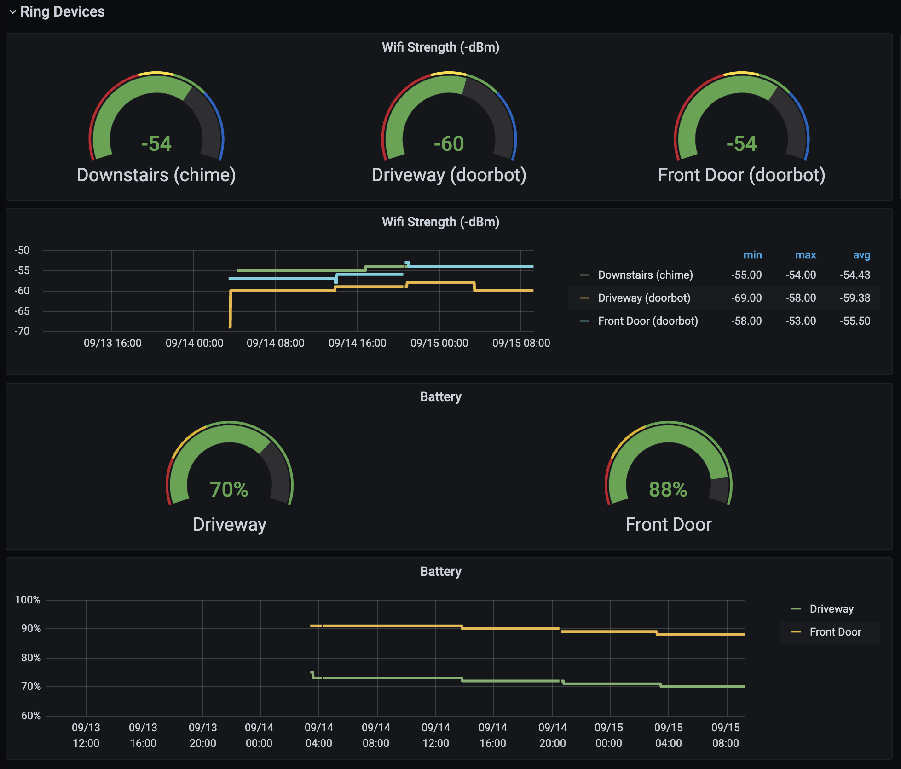

# A tool for exporting Prometheus-style metrics from Ring home devices

This project's goal was for me to be able to plot statistics like my doorbell's battery life, wifi strength, etc using [Prometheus](https://prometheus.io/) and [Grafana](https://grafana.com/). Effectively this:




The `ringapi` package in this module may turn out to be a generally useful thing so we'll see how this evolves.

Inspiration was taken largely from [python-ring-doorbell](https://github.com/tchellomello/python-ring-doorbell) as a great working example of Ring's 2FA implementation and a few of the available APIs. Some of the initial types I lifted from [golang-ring-doorbell](https://github.com/efarrer/golang-ring-doorbell) which I'm not sure works correctly with 2FA, but a few of the types were useful to copy anyway.

## Building

```sh
go build github.com/cheezypoofs/ring-exporter/cmd/ring-exporter
```

## Usage

### Initializing and Acquiring an OAUTH2 Token

Before you can use the exporter, it must be initialized. This includes creating the initial configuration file as well as creating a token for use in the API calls. Initialization can be re-executed to generate a new API token if for some reason a previously-generated one is no longer working.

To initialize a new config file (if needed) and (re)generate a token, execute the command:

```sh
./ring-exporter --config.file <path to config file> init
```

This will create a `ring-config.json` file in the path you specify if it does not already exist and will also prompt you through the 2FA process to persist a `ring-state.json` in the same directory as the config file and will include the token.

The `ring-config.json` will always migrate itself forward when you run a command and you can impose changes to the behavior by editing this file. This is where things like what port to expose metrics and other things will be exposed.

### Testing that it works

```sh
./ring-exporter --config.file <path to config file> test
```

This will make a one-time query and emit some text to indicate if things appear to be working.

### Executing as an exporter

This is meant to be the background task that basically runs forever or until terminated. This will start a small web service at `http://<ip>:9100/metrics` (or whatever you configure) and expose the metrics for scraping by prometheus.

```sh
./ring-exporter --config.file <path to config file> monitor
```
